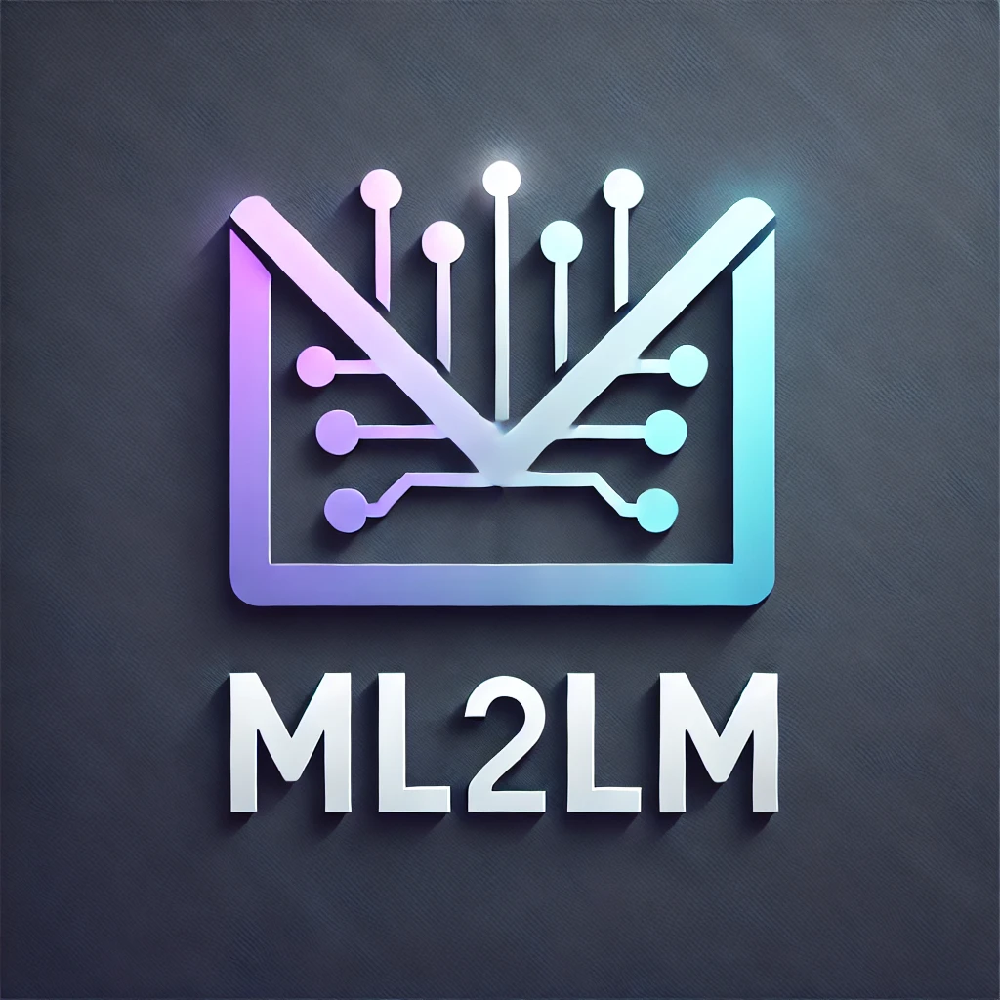

# ML2LM

Welcome to our channel, ML2LM. This repository will provide you the codes for the topics that we discuss on our youtube channel. We will sequentially update this repository based on the topics that we cover. We will cover all the topics both in Bengali and English medium. 

## Topics.
    
### 1. Python Basics 
#### 1.1 Data types and Operators. ([Click here for Codes](https://github.com/Debodeep94/ML2LM/blob/main/python_basics/data_types_and_operators.ipynb))
        ``` What Are Data Types? 
                Data types define the kind of value a variable can hold in a programming language. In Python, every piece of data (like numbers, text or a collection of items) has a specific data type that tells Python how to process and store that data. <br>

                Some examples: 
                Text like "Python" is a `str` (string).<br>
                An integer like 7 is an `int` datatype while a decimal like 7.7 is a `float`. <br>
                A value like `True` or `False` is a `bool` (boolean).<br>
                <br>

                #### Dynamic Typing in Python
                One of Python's strengths is dynamic typing, which means you don’t need to declare the type of a variable explicitly like java or C++. Python automatically determines the type of a variable based on the value you assign to it.
                <br>
                We can use the `type()` function to check the data type of a variable.```
#### 1.2 Data Structures ([Click here for Codes](https://github.com/Debodeep94/ML2LM/blob/main/python_basics/Data_Structures.ipynb))
    ```
    .. A way to store data in python. We discuss 4 different types of data structures.

        - Lists


        - Tuples
        
        - Sets
        
        - Dictionaries```


#### Control flow ([Click here for Codes](https://github.com/Debodeep94/ML2LM/blob/main/python_basics/control_flow.ipynb))

```
Control Flow determines the order in which individual instructions, statements, or function calls are executed in a program. Without it, a program would just run line by line, top to bottom, without any decision-making or looping.

    - Conditional Statements: The if-elif-else ladder
    - For loop
    - While loop
    - Jump statements
        - break
        - pass
        - continue
```
